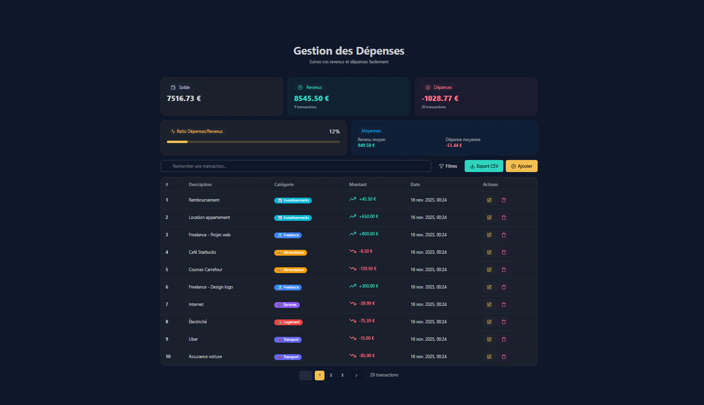

# 💰 Gestion des Dépenses - Application Fullstack Complète

<div align="center">



Application fullstack moderne de gestion des dépenses et revenus personnels, construite avec Django REST Framework et Next.js.

[](https://www.djangoproject.com/)
[](https://nextjs.org/)
[](https://reactjs.org/)
[](https://www.typescriptlang.org/)
[](https://tailwindcss.com/)
[](LICENSE)

[](https://github.com/SOULEYMANEHAMANEADJI/fullstack-expense-drf-next-js/actions)
[](TESTING.md)
[](TESTING.md)

[Démo](#-captures-décran) • [Installation](#-installation) • [Documentation](#-documentation) • [API](#-api-endpoints)

</div>

---

## 🎉 Statut : 100% Complet et Fonctionnel

Cette application est **entièrement développée** avec toutes les fonctionnalités CRUD, filtres avancés, catégories avec icônes colorées, statistiques en temps réel et export CSV.

## 🚀 Fonctionnalités

### Backend (Django REST Framework)

- ✅ **CRUD Complet** - Transactions et Catégories
- ✅ **Pagination** - 10 éléments par page (configurable)
- ✅ **Filtres Avancés** - Type, catégorie, montant, dates
- ✅ **Recherche** - Full-text search sur le texte
- ✅ **Tri** - Par date, montant (ascendant/descendant)
- ✅ **Statistiques Globales** - Balance, moyennes, ratios
- ✅ **Statistiques par Catégorie** - Total et compteur
- ✅ **Export CSV** - Téléchargement de toutes les transactions
- ✅ **Validation** - Texte min 3 caractères, montant non nul
- ✅ **Admin Django** - Interface d'administration complète
- ✅ **Seeder** - 12 catégories + 30 transactions de test

### Frontend (Next.js + React)

- ✅ **Interface Moderne** - TailwindCSS + DaisyUI
- ✅ **CRUD Complet** - Ajouter, modifier, supprimer
- ✅ **Liste Paginée** - Navigation entre les pages
- ✅ **Recherche Temps Réel** - Filtrage instantané
- ✅ **Filtres Multiples** - Type (revenus/dépenses), catégorie
- ✅ **Catégories Visuelles** - Icônes et couleurs personnalisées
- ✅ **Statistiques Dashboard** - Solde, revenus, dépenses, ratio
- ✅ **Export CSV** - Bouton de téléchargement
- ✅ **Responsive** - Adapté mobile et desktop
- ✅ **Notifications** - Toast pour chaque action

## 🛠️ Technologies

### Backend

- Django 5.2
- Django REST Framework
- django-cors-headers
- python-dotenv
- SQLite

### Frontend

- Next.js 15.4.5 (App Router + Turbopack)
- React 19.1.0
- TypeScript
- TailwindCSS 4
- DaisyUI 5.0.50
- Axios
- Lucide React (icônes)
- React Hot Toast (notifications)

## 📋 Installation

### Prérequis

- Python 3.10+
- Node.js 18+
- npm ou yarn

### 1. Backend

```bash
cd backend

# Créer l'environnement virtuel
python -m venv venv

# Activer l'environnement
venv\Scripts\activate  # Windows
# source venv/bin/activate  # Linux/Mac

# Installer les dépendances
pip install -r requirements.txt

# Créer les migrations
python manage.py makemigrations
python manage.py migrate

# Peupler la base de données (12 catégories + 30 transactions)
python manage.py seed_all

# (Optionnel) Créer un super utilisateur pour l'admin
python manage.py createsuperuser

# Lancer le serveur
python manage.py runserver
```

Le backend sera accessible sur **<http://localhost:8000>**

### 2. Frontend

```bash
cd frontend

# Installer les dépendances
npm install

# Lancer le serveur de développement
npm run dev
```

Le frontend sera accessible sur **<http://localhost:3000>**

## 🌐 URLs

- **Application :** <http://localhost:3000>
- **API Backend :** <http://localhost:8000/api/>
- **Admin Django :** <http://localhost:8000/admin>
- **Export CSV :** <http://localhost:8000/api/transactions/export/csv/>

## 📖 Documentation

- **[FEATURES_COMPLETE.md](FEATURES_COMPLETE.md)** - Liste complète des fonctionnalités
- **[TESTING.md](TESTING.md)** - ⭐ Guide des tests automatisés (Pytest + Jest)
- **[VALIDATION_COMPLETE.md](VALIDATION_COMPLETE.md)** - Documentation de validation
- **[TEST_API.md](TEST_API.md)** - Guide de tests API manuels
- **[CORRECTIONS_FINALES.md](CORRECTIONS_FINALES.md)** - Dernières corrections effectuées
- **[FRONTEND_TODO.md](frontend/FRONTEND_TODO.md)** - Guide détaillé du frontend
- **[MIGRATION.md](backend/MIGRATION.md)** - Guide de migration
- **[INSTALLATION.md](INSTALLATION.md)** - Instructions d'installation détaillées

## 📊 API Endpoints

### Transactions

- `GET /api/transactions/` - Liste des transactions (paginée)
- `POST /api/transactions/` - Créer une transaction
- `GET /api/transactions/{id}/` - Détails d'une transaction
- `PUT /api/transactions/{id}/` - Modifier une transaction
- `DELETE /api/transactions/{id}/` - Supprimer une transaction
- `GET /api/transactions/export/csv/` - Exporter en CSV

### Catégories

- `GET /api/categories/` - Liste des catégories
- `POST /api/categories/` - Créer une catégorie
- `GET /api/categories/{id}/` - Détails d'une catégorie
- `PUT /api/categories/{id}/` - Modifier une catégorie
- `DELETE /api/categories/{id}/` - Supprimer une catégorie
- `GET /api/categories/statistics/` - Statistiques par catégorie

### Statistiques

- `GET /api/statistics/` - Statistiques globales

## 🎨 Captures d'Écran

### Dashboard Principal

- Statistiques visuelles (solde, revenus, dépenses, ratio)
- Barre de recherche
- Filtres (type, catégorie)
- Bouton Export CSV
- Bouton Ajouter

### Liste des Transactions

- Tableau avec pagination
- Colonnes : #, Description, Catégorie, Montant, Date, Actions
- Badges colorés pour les catégories
- Icônes pour modifier/supprimer

### Modal Ajout/Modification

- Formulaire dynamique
- Champs : Texte, Montant, Catégorie (dropdown)
- Validation en temps réel
- Mode ajout ou modification

## 🧪 Tests

### Tests Backend (Pytest)

```bash
cd backend

# Installer les dépendances de test
pip install -r requirements.txt

# Lancer tous les tests
pytest

# Tests avec couverture
pytest --cov=api --cov-report=html

# Ouvrir le rapport de couverture
open htmlcov/index.html
```

### Tests Frontend (Jest)

```bash
cd frontend

# Installer les dépendances
npm install

# Lancer tous les tests
npm test

# Tests avec couverture
npm run test:coverage

# Tests en mode watch
npm run test:watch
```

### CI/CD

Le projet inclut GitHub Actions pour :

- ✅ Tests automatiques (backend + frontend)
- ✅ Vérification de la couverture de code
- ✅ Build automatique
- ✅ Déploiement sur Vercel
- ✅ Analyse de sécurité (CodeQL)

Voir [TESTING.md](TESTING.md) pour plus de détails.

## 🐛 Bugs Corrigés

### Version actuelle (2025-11-16)

- ✅ Filtre par catégorie maintenant fonctionnel
- ✅ Export CSV accessible (ordre des routes corrigé)
- ✅ Tous les filtres validés et testés

Voir [CORRECTIONS_FINALES.md](CORRECTIONS_FINALES.md) pour les détails.

## 🔜 Améliorations Futures (Optionnel)

- [ ] Authentification JWT (multi-utilisateurs)
- [ ] Graphiques visuels (Chart.js, Recharts)
- [ ] Budget tracking avec alertes
- [ ] Transactions récurrentes
- [ ] Upload de reçus/factures
- [ ] Support multi-devises
- [x] Tests automatisés (Pytest + Jest) ✅
- [x] CI/CD avec GitHub Actions ✅
- [ ] Déploiement Docker
- [ ] API Documentation (Swagger/OpenAPI)

## 📝 Structure du Projet

```
fullstack-expense/
├── backend/
│   ├── api/
│   │   ├── models.py              # Transaction, Category
│   │   ├── serializers.py         # Sérialisation API
│   │   ├── views.py               # Endpoints REST
│   │   ├── urls.py                # Routes API
│   │   ├── admin.py               # Admin Django
│   │   └── management/
│   │       └── commands/
│   │           └── seed_all.py    # Seeder
│   ├── backend/
│   │   ├── settings.py            # Configuration
│   │   └── urls.py                # Routes principales
│   ├── .env                       # Variables d'environnement
│   ├── requirements.txt           # Dépendances Python
│   └── MIGRATION.md
├── frontend/
│   ├── app/
│   │   ├── page.tsx               # Page principale
│   │   ├── layout.tsx             # Layout global
│   │   └── api.ts                 # Configuration Axios
│   ├── .env.local                 # Variables d'environnement
│   ├── package.json               # Dépendances Node
│   └── FRONTEND_TODO.md
├── README.md                      # Ce fichier
├── FEATURES_COMPLETE.md           # Fonctionnalités complètes
├── VALIDATION_COMPLETE.md         # Documentation de validation
├── TEST_API.md                    # Tests API
├── CORRECTIONS_FINALES.md         # Corrections récentes
└── INSTALLATION.md                # Installation détaillée
```

## 👨‍💻 Développement

### Variables d'environnement

**Backend** (`.env`) :

```env
SECRET_KEY=your-secret-key-here
DEBUG=True
CORS_ALLOWED_ORIGINS=http://localhost:3000
```

**Frontend** (`.env.local`) :

```env
NEXT_PUBLIC_API_URL=http://localhost:8000/
```

### Commandes Utiles

```bash
# Backend - Créer un super utilisateur
python manage.py createsuperuser

# Backend - Réinitialiser la base de données
python manage.py flush
python manage.py seed_all

# Frontend - Build de production
npm run build

# Frontend - Lancer en production
npm start
```

## 🤝 Contribution

Ce projet est un exemple éducatif complet. N'hésitez pas à l'utiliser comme base pour vos propres projets !

## 📄 Licence

MIT

## ✨ Crédits

Développé avec Django REST Framework, Next.js, et beaucoup de café ☕

---

**Dernière mise à jour :** 2025-11-16
**Statut :** ✅ Production Ready
